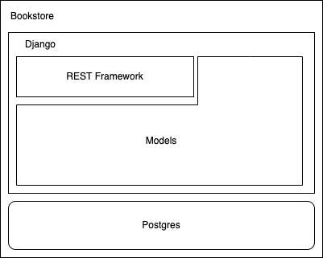

# Book Store API
A basic book store application that allows you to view books and their availability with the addition to check out/in them.  This is a completely open api with no authentication or authorization, this is done intentionally to utilize something like an envoy proxy and combination of decoupled authorization such as Open Policy Agent.

## Application Structure

### Architecture

Basic architecture overview of technology utilization

### Application Structure
The project is broken down into smaller applications with the intent to eventually break these down into separate processes that could be scaled as the individual needs of the platform grow (ex. scale to zero) and not have to scale the whole application vertically.

* bookapi - performs base level settings and url mappings
* books - handles all serialization and business logic for books
* transactions - handles the check in/out transactions and all relavant urls and serialization
* users - handles the users retrieve endpoints for the internal django user models

### Mappings

Quick reference to where urls land, ideally I would like to investigate the use of swagger documentation in line code generation instead of having this be a manual documentation as this would not be scalable as endpoints and things evolve.

| Path                          | App          |
| ----------------------------- | ------------ |
| users/                        | users        |
| users/{user_id}/books         | books        |
| authors/                      | books        |
| books/                        | books        |
| books/{book_id}/transaction   | transactions |
| transactions/                 | transactions |

## Running Locally
The easiest way to get started locally is to setup a virtualenv environment in this base and utilize the requirements file to install the required dependencies.  This guide assumes the installation of python3, pip3, and virtualenv.  This application utilizes a postgres database to store the data for the end points.  There is a provided docker compose to run the database server if you do not have one currently configured.

### Running Server Dependencies
You will need to run this in a separate terminal window from the remaining commands
1. `docker-compose up`

### Configure Virtualenv
Run the following set of commands to get your venv setup
1. `virtualenv -p python3 venv`
1. `source ./venv/bin/activate`
1. `pip install -r requirements.txt`

### Run the development server
To run the development server you'll first need to run the migration scripts to setup the database, and then run the actual django server.

1. `python manage.py migrate`
    1. This only needs run the first time or when changes are made to the models which would affect the database schema
1. `python manage.py runserver`

## Run with Docker
This could be run with docker locally or even inside of a kubernetes platform.  I started to break out the db_host into environment variables so that this could easily run in a container platform such as kubernetes.  There would need to be additional work for all the required properites to be broken out to accept secrets and other things for the database connectivity.

### Local docker
1. docker run -p 8000:8000 -e DB_HOST=host_of_postgres quay.io/mathianasj/bookstore:latest

### Docker Compose
1. docker-compose up -f full-docker-compose.yaml